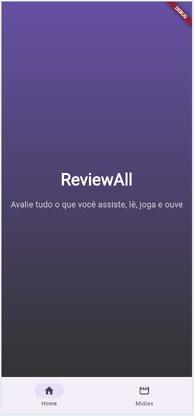
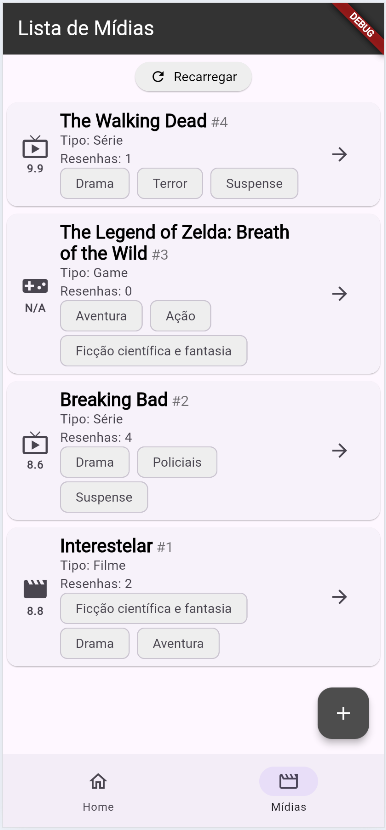
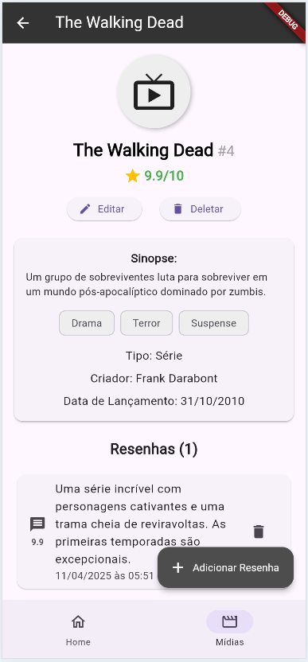
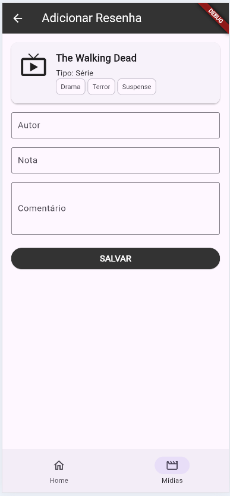
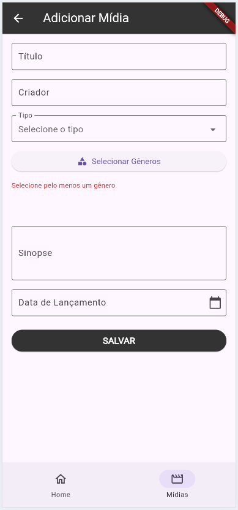

# reviewall_mobile

Aplicativo Flutter para gerenciar e avaliar diversos tipos de mídias, como filmes, séries, livros, jogos e muito mais.

**Você pode baixar o aplicativo para Android aqui:** [Download](https://drive.google.com/file/d/1wAxF1tJ6YBwpLQLSX4RY7r24QfOlge-K/view?usp=sharing)

## Sobre o Aplicativo

Este aplicativo foi desenvolvido como parte do curso de **PROGRAMACAO PARA DISPOSITIVOS MOVEIS I** na **UNIVERSIDADE ESTADUAL DO TOCANTINS** pelo aluno **ALFREDO DE SOUZA AGUIAR NETO**.
O aplicativo permite aos usuários:
- Adicionar, editar e excluir entradas de mídias.
- Adicionar resenhas para cada mídia, incluindo notas e comentários.
- Visualizar uma lista de mídias com detalhes como título, criador, tipo, gêneros, sinopse, data de lançamento e avaliação média, assim como uma lista de resenhas associadas a cada mídia.

## Integração com API

O aplicativo utiliza o [MockAPI](https://mockapi.io/projects/67e6f0a56530dbd31111f8e3) para criar uma API online para gerenciar mídias e resenhas. Os seguintes recursos e seus atributos são utilizados:

### Recurso de Mídia (`/media`)
- **id**: Identificador único da mídia (string).
- **createdAt**: Data e hora em que a mídia foi criada (formato ISO 8601).
- **title**: Título da mídia (string).
- **creator**: Criador da mídia (string).
- **type**: Tipo da mídia (ex.: "Filme", "Série", "Livro") (string).
- **genre**: Lista de gêneros associados à mídia (array de strings).
- **synopsis**: Breve descrição da mídia (string).
- **releaseDate**: Data de lançamento da mídia (formato ISO 8601).

### Recurso de Resenha (`/review`)
- **id**: Identificador único da resenha (string).
- **createdAt**: Data e hora em que a resenha foi criada (formato ISO 8601).
- **user**: Nome do usuário que escreveu a resenha (string).
- **rating**: Nota atribuída à mídia (double, máximo 10).
- **comment**: Comentário ou opinião sobre a mídia (string).
- **mediaId**: ID da mídia associada à resenha (string).

### Imagens de Tela

  
  

  
  

  

## Como Começar

Este projeto é um ponto de partida para um aplicativo Flutter.

Alguns recursos para começar se este for seu primeiro projeto Flutter:
- [Lab: Escreva seu primeiro aplicativo Flutter](https://docs.flutter.dev/get-started/codelab)
- [Cookbook: Exemplos úteis de Flutter](https://docs.flutter.dev/cookbook)

Para obter ajuda no desenvolvimento com Flutter, acesse a [documentação online](https://docs.flutter.dev/), que oferece tutoriais, exemplos, orientações sobre desenvolvimento móvel e uma referência completa da API.

<!-- Refatorar: 
lib/
├── components/    # Widgets reutilizáveis (botões, cards, list...)
├── models/        # Representações de dados (ex: UserModel, ProductModel)
├── screens/       # Telas do app (LoginScreen, HomeScreen...)
├── services/      # Lógica de acesso à API, SharedPreferences, etc
└── main.dart      # Ponto de entrada do app -->